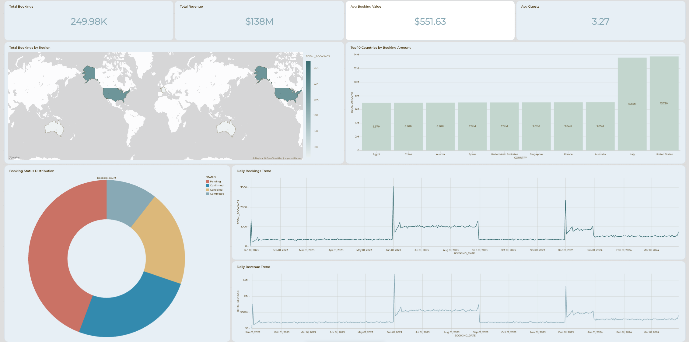

# Wander Data Platform

A production-oriented end-to-end data engineering platform built on Databricks.

This project demonstrates how to design, develop, test, deploy, and operate a modern data platform using **Databricks, Lakeflow, Unity Catalog, PySpark, Git, and Databricks Declarative Automation Bundles**.

---

## Overview

The Wander Data Platform processes booking data from the Databricks Wanderbricks dataset through a governed **Medallion Architecture** and produces analytics-ready Gold data products.

The current implementation focuses on the **booking domain** and demonstrates:

- Source-aligned Bronze ingestion
- Silver data validation and standardization
- Data quality expectations
- Invalid-record handling through quarantine
- Contract-based data definitions
- Gold business aggregations
- Automated unit testing
- Databricks Bundle deployment
- Environment-specific configuration
- Databricks SQL analytics
- Interactive business dashboards
- Git-based development

The platform is intentionally designed using production-oriented engineering practices so that it can be extended to additional domains and deployment environments.

---

# Architecture

The current platform follows a Medallion Architecture implemented with Databricks Lakeflow.

```text
                    Wanderbricks
                   Source Dataset
                         │
                         ▼
                ┌─────────────────┐
                │     BRONZE      │
                │  bronze_bookings│
                │                 │
                │ Raw source data │
                └────────┬────────┘
                         │
                         ▼
                ┌─────────────────┐
                │     SILVER      │
                │  silver_bookings│
                │                 │
                │ Data validation │
                │ Quality rules   │
                └────────┬────────┘
                         │
                  ┌──────┴──────┐
                  │             │
                  ▼             ▼
        ┌────────────────┐  ┌──────────────────┐
        │   QUARANTINE   │  │       GOLD       │
        │                │  │                  │
        │ Rejected data  │  │ Daily business   │
        │                │  │ metrics          │
        └────────────────┘  └────────┬─────────┘
                                     │
                                     ▼
                            ┌──────────────────┐
                            │ Databricks SQL   │
                            │    Dashboard     │
                            └──────────────────┘
```

---

# Environment Strategy

The platform uses Databricks Declarative Automation Bundles to manage environment-specific deployment configuration.

The current implementation uses **Databricks Free Edition**, which provides a single workspace.

Environment separation is therefore implemented through Bundle deployment targets and environment-specific catalog/schema configuration.

Current targets:

- **DEV** — development and testing
- **PROD** — production-oriented deployment configuration

The architecture is designed so that the same deployment model can later be promoted to separate Databricks workspaces when additional environments become available.

---

# Data Architecture

## Bronze

The Bronze layer contains source-aligned booking data with minimal transformation.

### Responsibilities

- Source ingestion
- Preservation of source structure
- Traceability to the source dataset
- Initial ingestion layer for downstream processing

Current table:

```text
bronze_bookings
```

---

## Silver

The Silver layer contains validated booking records.

### Responsibilities

- Data quality enforcement
- Validation of required fields
- Validation of booking dates
- Validation of guest counts
- Validation of monetary values
- Validation of booking status
- Standardization for downstream analytics

Current table:

```text
silver_bookings
```

---

## Quarantine

The Quarantine layer isolates rejected records from the main analytical flow.

Current implementation includes handling for invalid booking records such as negative booking amounts.

Current table:

```text
quarantine_bookings
```

This approach prevents invalid records from contaminating downstream analytical datasets while preserving rejected records for investigation.

---

## Gold

The Gold layer contains business-ready analytical metrics derived from validated Silver bookings.

Current table:

```text
gold_booking_daily
```

The Gold dataset provides daily metrics including:

```text
booking_date
total_bookings
confirmed_bookings
completed_bookings
cancelled_bookings
pending_bookings
total_revenue
average_booking_value
average_guests
```

The table is generated by aggregating validated Silver bookings by booking date.

---

# Source Data

The primary source is the Databricks **Wanderbricks** dataset.

The source represents a travel marketplace and contains multiple business entities, including:

- Users
- Bookings
- Properties
- Hosts
- Cities
- Amenities
- Property amenities
- Property images
- Employees

The current implementation focuses on the **Bookings** domain.

The shared source data is treated as read-only. Transformations are performed within the managed Bronze, Silver, Quarantine, and Gold layers.

---

# Booking Data Quality

Data quality is treated as a first-class component of the pipeline.

Current booking expectations include:

```text
booking_id IS NOT NULL
user_id IS NOT NULL
property_id IS NOT NULL
check_in IS NOT NULL
check_out IS NOT NULL
check_out >= check_in
guests_count > 0
total_amount >= 0
status IN (
    'pending',
    'confirmed',
    'cancelled',
    'completed'
)
```

These rules protect the Silver layer from invalid records and provide a consistent quality boundary between raw and analytical data.

---

# Data Contract

A booking data contract is maintained in:

```text
contracts/bookings.yml
```

The contract documents:

- Dataset definition
- Primary key
- Column types
- Nullability
- Column constraints
- Allowed status values
- Relationships to other business entities

Example:

```yaml
primary_key:
  - booking_id

columns:
  booking_id:
    type: bigint
    nullable: false

  guests_count:
    type: int
    nullable: false

  total_amount:
    type: float
    nullable: false
```

The contract provides a foundation for future schema validation and expansion of the platform's data governance framework.

---

# Gold Business Metrics

The current Gold data product provides analytics-ready booking metrics.

The resulting dataset contains:

- Total bookings
- Confirmed bookings
- Completed bookings
- Cancelled bookings
- Pending bookings
- Total revenue
- Average booking value
- Average guests

The current dataset contains approximately:

**249,983 validated bookings**

and provides daily analytical observations across the available booking period.

---

# Analytics Dashboard

The Gold layer is consumed through a **Databricks SQL Dashboard** named:

```text
Wander Booking Analytics
```

The dashboard provides:

- Total bookings
- Total revenue
- Average booking value
- Average guests
- Booking status distribution
- Daily booking trends
- Daily revenue trends
- Geographic booking analysis
- Top-country revenue analysis

Example KPI output:

```text
Total Bookings       249.98K
Total Revenue        $138M
Average Booking      $551.63
Average Guests       3.27
```

The dashboard provides a business-facing consumption layer on top of the Gold data product.

# Analytics Dashboard

The Gold layer is consumed through an interactive Databricks SQL dashboard providing business-level booking, revenue, geographic, and status analytics.



---

# Testing

The project includes automated Python unit tests using `pytest`.

Tests currently cover the Bronze booking pipeline and related local functionality.

Run the test suite with:

```bash
uv run pytest
```

Example result:

```text
1 passed
```

Databricks Bundle configuration is also validated before deployment:

```bash
databricks bundle validate -t dev
```

---

# Deployment

The project uses **Databricks Declarative Automation Bundles** for deployment.

The main Bundle configuration is:

```text
databricks.yml
```

Pipeline resources are defined under:

```text
resources/
```

Deploy to the development environment with:

```bash
databricks bundle deploy -t dev
```

Validate the Bundle with:

```bash
databricks bundle validate -t dev
```

The current development deployment uses:

```text
catalog = workspace
schema  = dev
```

The production target is configured separately using:

```text
catalog = workspace
schema  = prod
```

---

# Development Workflow

The project follows a Git-based development workflow.

```text
Feature Branch
      │
      ▼
Local Development
      │
      ├── Unit Tests
      ├── Code Validation
      └── Bundle Validation
      │
      ▼
Git Commit
      │
      ▼
Git Push
      │
      ▼
Databricks Deployment
      │
      ▼
Pipeline Execution
      │
      ▼
Analytics Dashboard
```

---

# Repository Structure

```text
wander-data-platform/
│
├── contracts/
│   ├── bookings.yml
│   ├── loader.py
│   └── bookings.old.py
│
├── src/
│   └── wander_data_platform_etl/
│       ├── __init__.py
│       ├── bronze/
│       │   └── bookings.py
│       ├── silver/
│       │   └── bookings.py
│       ├── quarantine/
│       │   └── bookings.py
│       └── gold/
│           └── bookings.py
│
├── tests/
│   ├── conftest.py
│   └── unit/
│       └── test_bronze_bookings.py
│
├── resources/
│   └── wander_data_platform_etl.pipeline.yml
│
├── databricks.yml
├── pyproject.toml
├── uv.lock
├── AGENTS.md
├── CLAUDE.md
└── README.md
```

---

# Technology Stack

## Data Platform

- Databricks
- Lakeflow
- Apache Spark
- PySpark
- Delta Lake
- Unity Catalog
- Databricks SQL

## Development

- Python
- SQL
- Git
- GitHub
- uv

## Deployment

- Databricks Declarative Automation Bundles
- Databricks CLI

## Testing

- pytest
- Data quality expectations
- Bundle validation

## Governance

- Unity Catalog
- Environment-specific catalogs and schemas
- Data contracts
- Source data isolation

---

# Engineering Principles

The project follows production-oriented engineering principles:

1. Source data remains read-only.
2. Data transformations are organized using Medallion Architecture.
3. Data quality is enforced before analytical consumption.
4. Invalid records are isolated from trusted analytical datasets.
5. Deployment configuration is defined as code.
6. Application code is version controlled with Git.
7. Unit tests are executed before deployment.
8. Environment-specific configuration is maintained through deployment targets.
9. Gold datasets are designed around business consumption.
10. The platform is designed for incremental expansion to additional domains.

---

# Project Status

🚧 **Active Development**

## Completed

- [x] Local development environment
- [x] Databricks CLI configuration
- [x] Databricks workspace authentication
- [x] Source data discovery
- [x] Medallion architecture
- [x] Bronze booking pipeline
- [x] Silver validation pipeline
- [x] Quarantine handling
- [x] Data quality expectations
- [x] Booking data contract
- [x] Gold daily booking metrics
- [x] Databricks Declarative Automation Bundle
- [x] DEV deployment
- [x] Unit tests
- [x] Databricks SQL analytics dashboard
- [x] Git-based development workflow

## Planned

- [ ] GitHub Actions CI
- [ ] GitHub Actions CD
- [ ] STAGE deployment
- [ ] Production deployment
- [ ] Integration tests
- [ ] Monitoring and observability
- [ ] Additional source entities
- [ ] Expanded analytical data model
- [ ] Automated data contract validation
- [ ] Operational runbooks

---

# Future Improvements

The platform is designed to evolve beyond the current booking-domain implementation.

Potential future enhancements include:

- Additional Bronze/Silver pipelines for Users, Properties, Hosts, and Cities
- Fact and dimension data models
- Incremental ingestion
- Slowly Changing Dimensions
- Automated schema evolution handling
- Referential integrity validation across domains
- GitHub Actions CI/CD
- Integration testing
- Data observability
- Pipeline monitoring and alerting
- Production deployment across separate Databricks workspaces
- Automated data contract enforcement
- Advanced analytical dashboards

---

# Key Takeaway

The Wander Data Platform demonstrates an end-to-end modern data engineering workflow:

```text
Source
  │
  ▼
Bronze
  │
  ▼
Silver ───────► Quarantine
  │
  ▼
Gold
  │
  ▼
Analytics
  │
  ▼
Databricks Dashboard
```

The project combines **data engineering, data quality, governance, deployment automation, testing, and business analytics** into a single Databricks-based platform.

---

## Author

**Soheil Moosavi**

Data Engineer | Data Platform | Databricks | Azure | Oracle | SQL Server
